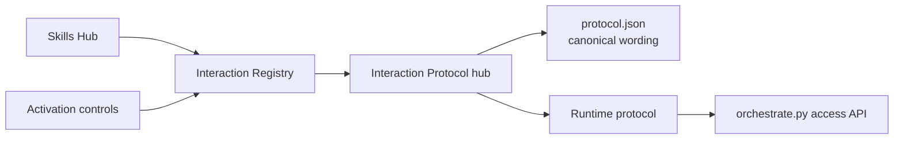
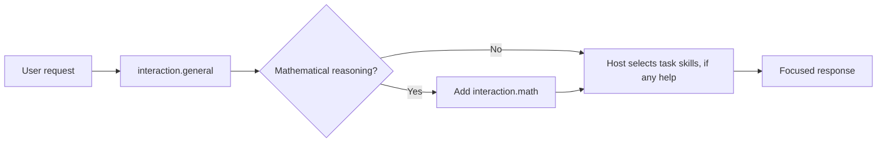
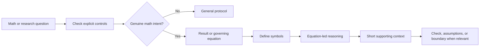

# Interaction Protocol

Back to [[docs/00_SKILLS_HUB|Skills Hub]] · Controls:
[[orchestrator/registry/activation|Activation]] · Registry:
[[orchestrator/registry/interaction|Interaction Registry]] · Runtime:
[[orchestrator/runtime/PROTOCOL|Runtime Protocol]] · API:
[[orchestrator/runtime/API_CONTRACT|API Contract]]

This is one public interaction skill package and its visible Obsidian hub. The canonical
machine-readable wording lives in [protocol.json](protocol.json). The registry
controls whether general and math behavior is active. The host applies the
response mode independently of task-skill selection; the interaction package
never counts as a task skill.

## Authority map

## General request flow

## Mathematical response flow

## Controls and tests

- `interaction.general`: active or off.
- `interaction.math`: active, manual, or off.
- `#> interaction math` or `#> interaction general`: explicit response mode for
  the current request.
- `#> use auto|none|<package IDs>`: task-skill selection; it never changes the
  interaction mode.
- `#> format mermaid+summary`: request known output forms.
- `#> depth compact|standard|deep` (`brief` and `detailed` are aliases):
  request explanation depth.
- `#> receipt auto|on|off`: show the task receipt (Task understood, Plan,
  Skills, Mode) automatically, on every request, or never.
- Access tests: [test_model_context.py](../../orchestrator/tests/test_model_context.py).
- Runtime tests: [test_registry_runtime.py](../../orchestrator/tests/test_registry_runtime.py).
- Graph tests: [test_graph_layers.py](../../orchestrator/tests/test_graph_layers.py).

The interaction protocol changes response structure only. It grants no file,
network, credential, account, or destructive-action authority.
